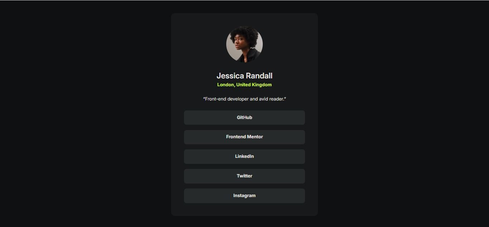

# Frontend Mentor - Social links profile solution

This is a solution to the [Social links profile challenge on Frontend Mentor](https://www.frontendmentor.io/challenges/social-links-profile-UG32l9m6dQ). Frontend Mentor challenges help you improve your coding skills by building realistic projects. 

## Table of contents

- [Overview](#overview)
  - [The challenge](#the-challenge)
  - [Screenshot](#screenshot)
  - [Links](#links)
- [My process](#my-process)
  - [Built with](#built-with)
  - [What I learned](#what-i-learned)
  - [Continued development](#continued-development)
- [Author](#author)


## Overview

### The challenge

Users should be able to:

- See hover and focus states for all interactive elements on the page

### Screenshot



### Links

- Solution URL: [https://github.com/EmmanuelIdeho/social-links-profile/](https://github.com/EmmanuelIdeho/social-links-profile/)
- Live Site URL: [https://illustrious-cobbler-e844db.netlify.app/](https://illustrious-cobbler-e844db.netlify.app/)

## My process

### Built with

- Semantic HTML5 markup
- CSS custom properties
- CSS Grid
- Mobile-first workflow

### What I learned

```html
<li>
  <a href="#" class="button">GitHub</a>
</li>
```
```css
  .button:hover,
.button:focus {
    background-color: var(--green);
    color: var(--grey-900);
}
```
### Continued development

I need to work on reducing the size of the card and making it more responsive.

## Author

- Frontend Mentor - [@EmmanuelIdeho](https://www.frontendmentor.io/profile/EmmanuelIdeho)
- Instagram - [@eman_thecoder](https://www.instagram.com/eman_thecoder/)

